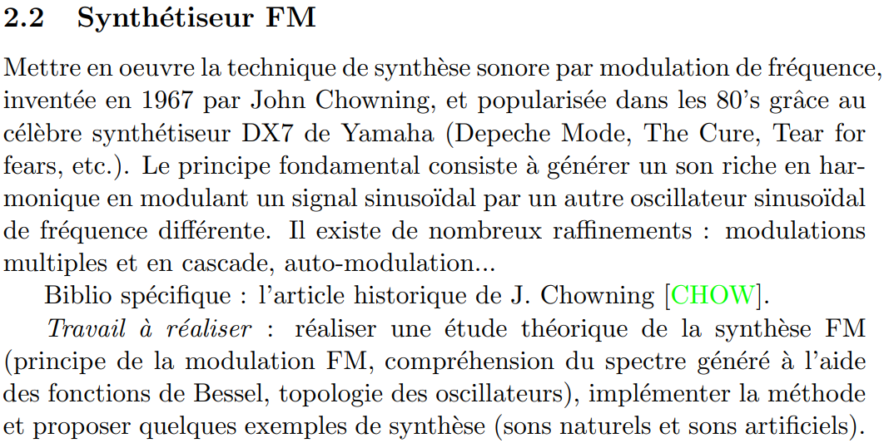
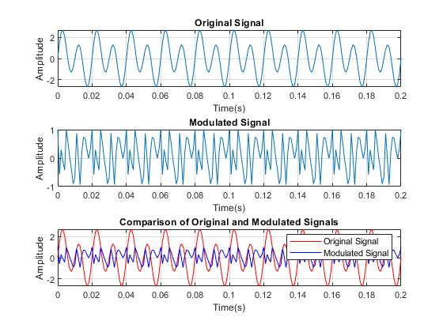
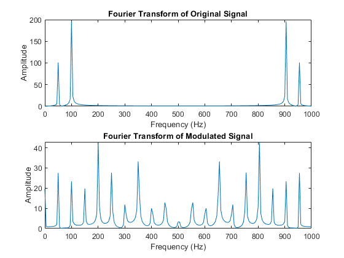
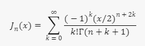
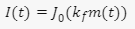
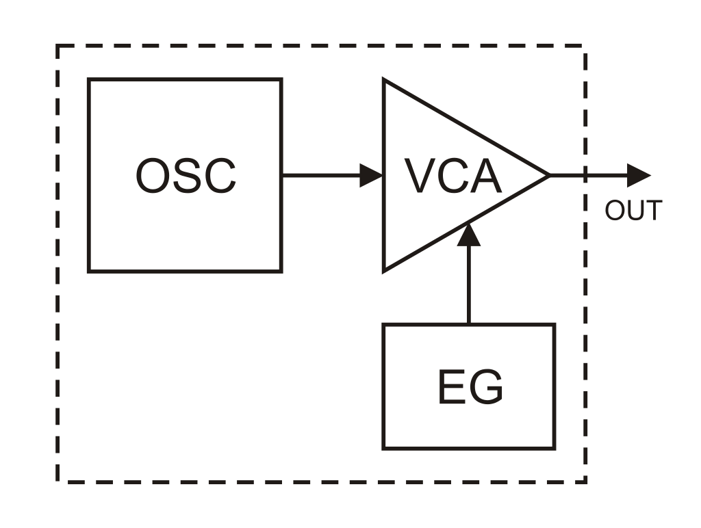
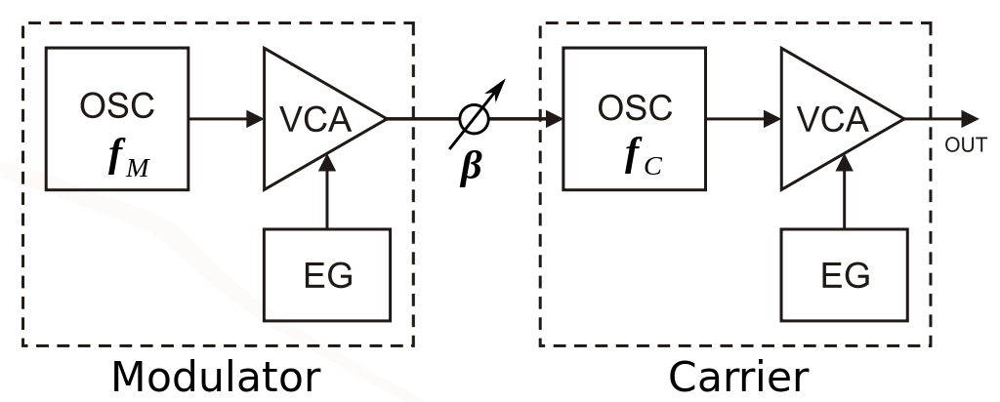
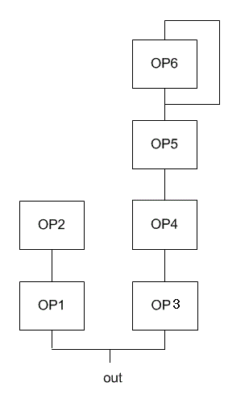

# Etude-Synthetiseur-FM

data sheet proposée par Reynal : [lien](datasheets/projet_Article_Chowning_Synthese_FM.pdf)

# Sommaire
1.  [Etat de l'art](etat-de-l'art.md) 
2.  [Etude théorique](#1-etude-théorique)
    - [Principe de la modulation](#principe-de-la-modulation)
    - [Relation entre FM et Bessel](#relation-privilégiée-entre-fm-et-bessel)
3.  [La synthèse FM](#la-synthèse-fm)
    - [Opérateur](#opérateur)
    - [Algorythmes](#Algorythmes)
4.  [Mise en oeuvre de la synthèse sonore](#Mise_en_oeuvre-de-la-synthèse-sonore)
    - Application théorique sur matlab
    - Application expérimentale sur MaxMSP 

# 1. Etat de l'art 
[lien](etat-de-l'art.md)
# 2. Etude théorique

## Principe de la modulation

En FM, la fréquence instantanée d'une onde porteuse varie en fonction d'une onde modulante, de sorte que la vitesse à laquelle la porteuse varie est la fréquence de l'onde modulante. La variation de la porteuse autour de sa moyenne (ou écart de fréquence de crête) est proportionnelle à l'amplitude de l'onde modulante. Les paramètres d'un signal modulé en fréquence sont les suivants :

- c = fréquence de la porteuse ou fréquence moyenne
- m = fréquence de modulation
- d = écart maximal.

L'équation d'une onde modulée en fréquence d'amplitude de crête A, où l'onde porteuse et l'onde modulante sont toutes deux des sinusoïdes, est la suivante :
- ***e = A sin(at + I sin(Bt))***

ou

- e  = l'amplitude instantanée de l'onde porteuse modulée
- α = la fréquence de la porteuse en rad/ s
- β = la fréquence de modulation en rad/s
- ***I = d/m*** = l'indice de modulation, le rapport entre l'écart maximal et la fréquence de modulation.

La largeur de bande totale est approximativement égale à deux fois la somme de l'écart de fréquence et de la fréquence de modulation : ***BW = 2 ( d + m )***

En outre, la synthèse de fréquence modulée (FM) et les fonctions de Bessel sont étroitement liées.
## Relation privilégiée entre FM et Bessel
#### Petit rappel :
Les fonctions de Bessel sont des solutions à l’équation différentielle de Bessel.

Elles apparaissent dans divers problèmes mathématiques et physiques, notamment la conduction de la chaleur, l’électromagnétisme et la diffraction.
Mathématiquement, les fonctions de Bessel de première espèce Jn​(x) sont données par :

où Γ(n) est la fonction gamma.

Les fonctions de Bessel sont oscillantes et jouent un rôle crucial dans la synthèse FM.

La répartition en fréquence des partiels générés par la synthèse FM est déterminée par le rapport entre la fréquence de la porteuse et celle de la modulante.

Les fonctions de Bessel apparaissent dans l’expression mathématique de la modulation d’amplitude (AM) et de la modulation de fréquence (FM).

L’indice de modulation I dans la synthèse FM est lié aux fonctions de Bessel.

Plus précisément, la modulation FM peut être exprimée en termes de fonctions de Bessel.(donc relation privilégiée)

## La synthèse FM
### Opérateur
Dans cette forme de synthèse, au lieu d’utiliser de simples oscillateurs, nous utiliserons des opérateurs qui sont la combinaison d’un oscillateur (sinus), d’un amplificateur et d’un générateur d’enveloppe. Ce n’est donc plus seulement un oscillateur qui agit sur un autre, mais un opérateur qui module un autre opérateur.

Ce schéma, ci-dessous, présente le fonctionnement de la synthèse FM avec deux opérateurs, mais il est possible d’en avoir bien plus ! Comme la synthèse additive, la synthèse FM est capable de créer des ondes très complexes, pleines d’harmoniques, mais avec seulement deux opérateurs au lieu d’un oscillateur par harmonique.

### Algorythmes 

Le principe des "algorithmes"  est implantés dans les synthétiseurs, par exemple le DX7. Il repose sur l'association d'oscillateurs.
Un algoritme FM est une association de 6 oscillateurs (ou "opérateurs"), dont un au moins est modulé en fréquence (32 algorithmes dans le DX7 ).

## Applications sur matlab et MSP
### Création d'une synthèse FM sur matlab
- Etude théorique : [FM_Theorique](FM_Theorique.m)
- Sinthese FM simple :[FMsyhthe](FMsyhthe.m)
### Création d'un synthétiseur FM sur PureData 
