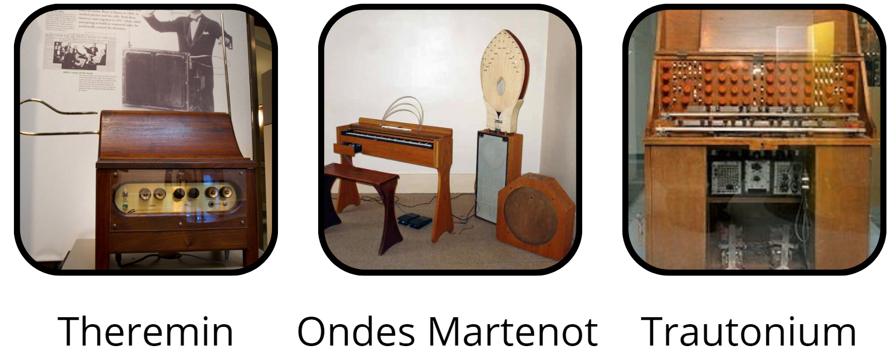
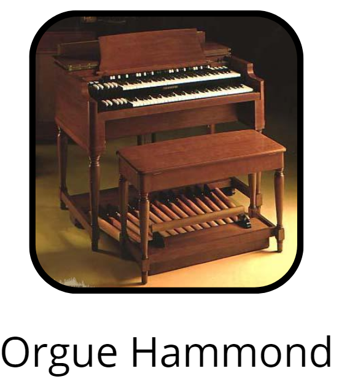
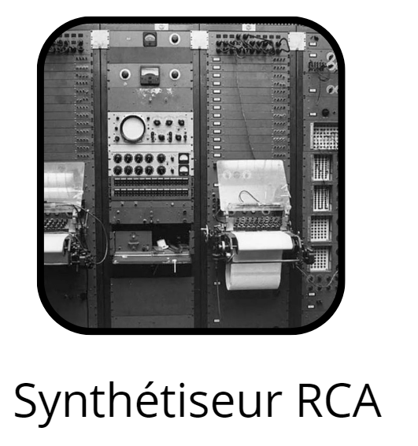
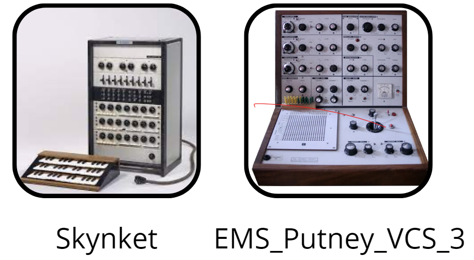
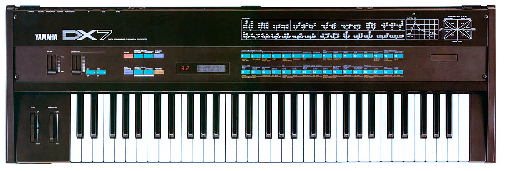

# Etat de l'art
## Les synthétiseurs
### Les premiers pas
La naissance des sons synthétiques remonte au début du XXe siècle, lorsque les fabricants exploitent l’électricité dans la lutherie comme moyen de contrôle et de création directe. Ils restent au service d’un langage traditionnel.

Les premières tentatives d’élargir la palette des instruments commencent avec le Theremin (ou Etherphone, 1922), les ondes Martenot (1928) et le Trautonium (1930). Ces premières machines musicales témoignent d’un attrait grandissant pour l’expérimentation et la mécanisation de l’exécution musicale.

La maîtrise des techniques d’oscillations électriques d’amplification et de restitution des sons par l’intermédiaire de haut-parleurs est décisive et permet l’éclosion des procédés électriques puis électroniques de génération sonore. Cette génération sonore peut être appelée « analogique », l’origine du son généré après amplification et diffusion étant une oscillation électrique analogue à l’onde sonore générée.

Les années 30 sont marquées par les instruments électromécaniques et électroacoustiques. Les premiers laissent une grande part à l’expérimentation en introduisant au sein de l’instrument des dispositifs mécaniques dont les composants sont électriques, à l’image de l’orgue Hammond, instrument à clavier et à pédalier datant de 1934, constitué d’un générateur de sons à roues phoniques. Les seconds, de facture traditionnelle (par exemple, la guitare), intègrent des technologies d’amplification électrique (le haut-parleur, le microphone).

Ces innovations technologiques successives, premières tentatives de resynthétiser des instruments de facture « traditionnelle », permettent l’avènement du synthétiseur.

### Les premiers synthétiseurs

En 1952, la firme américaine RCA (Radio Corporation of America) développe le premier synthétiseur créé par Harry Olson et Herbert Belar, capable de créer artificiellement des sons.

A la même époque, Max Matthews, ingénieur à la Bell Telephone invente la synthèse digitale : les sons les plus insolites peuvent être créés à partir de signaux numériques. La mise à disposition d’un instrument générateur de son transforme dès lors la relation avec la machine. Désormais, les ressources nécessaires à la composition de musique électronique sont accessibles en dehors des studios.

Il faut attendre les années 60 et la miniaturisation du transistor pour vraiment parler de synthétiseur moderne.

Au cours de cette décennie la miniaturisation et la baisse du prix de revient des machines, entre autres, favorisent une diffusion plus large du synthétiseur. L’année 1964 est décisive : trois modèles incontournables sont développés simultanément, réunissant des fonctions de traitement et de synthèse du son :

- Le Synket de l’ingénieur Paolo Ketoff fait figure de pionnier en intégrant les éléments fondamentaux qui seront repris par la suite dans la plupart des synthétiseurs. Transtorisé, il comporte plusieurs oscillateurs, des filtres influant sur les timbres et un système de modulation de fréquence ;
- La même année, Robert Moog met au point le contrôle en tension (voltage control) et développe un instrument piloté par clavier, composé de modules autonomes. Dans le même temps, un autre Américain, Donald Buchla, a lui aussi l’idée d’utiliser des modules interconnectables ;
- Le synthétiseur VCS-3 développé en 1969 par la firme anglaise EMS propose pour la première fois des modules non séparés, conçus comme un ensemble. Il marque le début des modèles à modules précâblés, déterminés au préalable par les différents fabricants.

  

Un peu plus de dix ans auront ainsi suffi pour passer des prototypes de laboratoire aux installations produisant des instruments à une échelle industrielle. Les synthétiseurs s’apparentent bientôt à des biens de consommation courante et le marketing est dynamique. Les artisans du synthétiseur se marginalisent rapidement au profit des grandes marques.

## Les premiers synthétiseurs FM

### Histoire
La synthèse FM (génération numérique de sons par Modulation de Fréquence) a été découverte plus ou moins par accident par John Chowning, au début des 70s, en expérimentant avec un synthé analogique de son université. Chowning remarque que les fréquences aiguës peuvent modifier le timbre de sa forme d’onde de base : c’est ainsi qu’est née la synthèse FM ! Le brevet a été par la suite racheté par Yamaha, qui l’a utilisé dans son synthétiseur DX7, un modèle qui changera le monde de la musique.

Avant l’invention de la synthèse FM, c’est la synthèse analogique (soustractive) qui est à l’ordre du jour. Elle permet de créer de beaux sons, mais a néanmoins certaines limites. À l’époque, les premiers samplers constituent la seule alternative, mais ils ne sont pas exactement abordables… Grâce à la synthèse FM, le processus de créer des sons inédits devient accessible à tout le monde. Quelques années plus tard, quand les prix des samplers et des ROMplers commencent à tomber, la synthèse FM commence à perdre de sa popularité. Beaucoup plus tard, après l’arrivée des synthétiseurs logiciels (entre autres au format VST), les synthés FM reprennent du terrain. Et c’est à partir de là que les choses commencent vraiment à décoller.

### Des progrès importants dans les technologies des semi-conducteurs
Au début des années 80, les composants électroniques basés sur semi-conducteurs connaissent une explosion de popularité : des appareils impossibles à fabriquer avec les technologies antérieures commencent à apparaître sur le marché et se succèdent rapidement. Des termes tels que "circuit intégré" et "intégration à grande échelle" commencent à apparaître dans les énoncés des examens d’entrée à l’université, et nombre de fabricants se lancent dans la production de jeux électroniques basés sur ce type de circuits. Les avancées réalisées dans le domaine des semi-conducteurs au fil de cette décennie sont vraiment remarquables.

Une des technologies les plus notables que permettent ces progrès rapides est la synthèse FM (génération numérique de sons par modulation de fréquence). Ce procédé de synthèse sonore a été développé à l’origine à l’Université de Stanford, aux USA, et Yamaha fut la première entreprise à identifier son potentiel, signant avec l’Université un contrat de licence exclusive dès 1973.
0
L'un des points forts de la synthèse FM est sa capacité à recréer, avec un remarquable réalisme, les sons évolutifs et riches en harmoniques : par exemple, le piano électrique, les cuivres, le glockenspiel. Aujourd’hui, l’échantillonnage est devenu la base de la génération sonore, et comme cette technique part d’enregistrements réels, nous nous sommes habitués à ce que nos synthétiseurs restituent sans effort les sons de nombreux instruments de musique différents. Mais au début des années 80, les synthétiseurs analogiques étaient tout simplement incapables de restituer certains types de sons, comme les sons de cloches ou de percussions métalliques. Sous cet aspect, les sons FM du GS1 étaient incroyables.

### L’arrivée du DX7 transforme la scène musicale
Le DX7 introduisit plusieurs innovations majeures, dont un écran LCD permettant la visualisation des paramètres et la nomination des sons, ainsi que l'utilisation de cartouches mémoire pour stocker des sons professionnels. De plus, sa mécanique de clavier sensible à la vélocité et à la pression améliorait considérablement l'expression musicale, tandis que sa compatibilité MIDI ouvrait de nouvelles possibilités d'interconnexion et de contrôle. En résumé, le DX7 s'est imposé comme un instrument révolutionnaire, influençant profondément la musique des années 80, notamment dans les genres dance et techno, grâce à ses capacités sonores et à sa polyvalence remarquable.

Dans les années précédant le lancement du DX7, Yamaha était à la pointe de l'innovation dans le domaine des synthétiseurs. Leur exploration de la synthèse sonore par algorithme avec le prototype PAMS (Programmable Algorithm Music Synthesizer) a été une étape majeure. Cependant, la complexité de ce système rendait difficile sa commercialisation grand public.

De plus, le DX7 a introduit l'utilisation de cartouches mémoire pour stocker et rappeler les sons. Cette fonctionnalité, rendue possible par la conception numérique du synthétiseur, a permis aux musiciens d'accéder à une grande variété de sons professionnels avec une précision absolue. Il était désormais possible de reproduire exactement les sons des professionnels, ce qui était révolutionnaire à l'époque.

Le DX7 a également marqué l'adoption précoce par Yamaha du protocole MIDI, permettant aux musiciens d'échanger des informations numériques entre les instruments. Cela a ouvert de nouvelles possibilités d'interconnexion et de contrôle, faisant du DX7 un élément central des studios de musique et des performances live.

Dans l'ensemble, le DX7 a été bien plus qu'un simple synthétiseur ; il a été une révolution dans le monde de la musique, ouvrant de nouvelles possibilités sonores et techniques qui ont façonné la musique des années 80 et au-delà.

